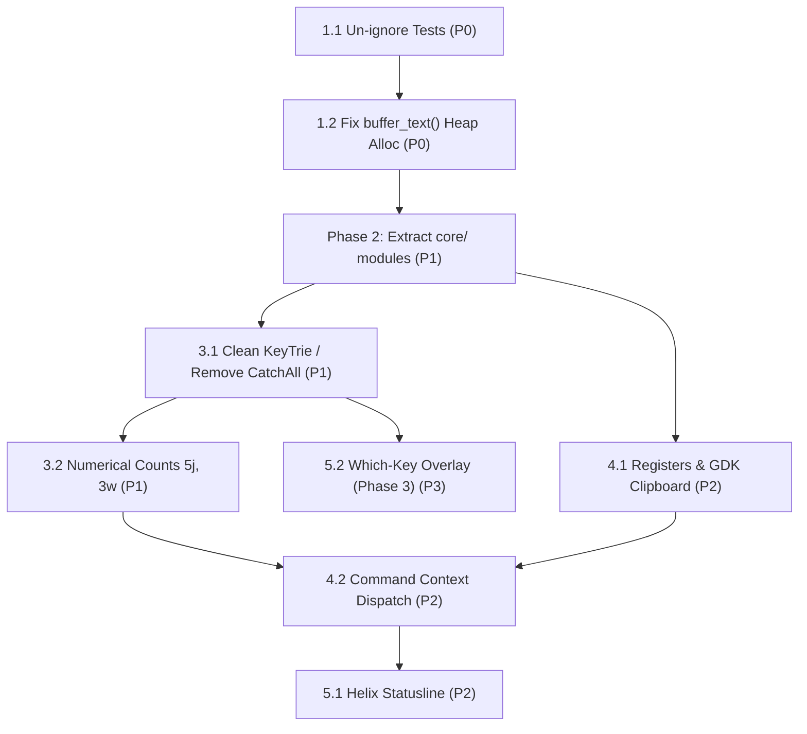

# Strand Architecture & Refactoring TODO

A prioritized, dependency-ordered roadmap to align Strand with the [Helix](reference/helix) codebase architecture while preserving GTK4/SourceView5 performance invariants.

---

## Architecture Blueprint (Helix vs. Strand Target)

```
Strand Target Structure                 Helix Reference Inspiration
───────────────────────────────────     ───────────────────────────
src/core/                               helix-core/
  ├── chars.rs                            ├── chars.rs
  ├── selection.rs                        ├── selection.rs
  ├── movement.rs                         ├── movement.rs
  ├── textobject.rs                       ├── textobject.rs
  ├── surround.rs                         ├── surround.rs
  └── match_brackets.rs                   └── match_brackets.rs

src/editor/                             helix-view/
  ├── state.rs                            ├── editor.rs
  ├── register.rs                         ├── register.rs / clipboard.rs
  └── theme.rs                            └── theme.rs

src/commands/                           helix-term/commands.rs
  ├── mod.rs (Context, MappableCommand)   ├── commands.rs (Context<'a>)
  ├── motion.rs                           └── commands/
  └── edit.rs

src/keymap/                             helix-term/keymap/ & helix-view/input.rs
  ├── input.rs (KeyEvent, GDK parser)     ├── input.rs
  ├── trie.rs (Generic KeyTrie + counts)  ├── keymap.rs
  └── default.rs (Default keybindings)    └── default.rs

src/components/                         helix-term/ui/ & compositor.rs
  ├── editor/                             ├── ui/editor.rs
  ├── statusline/                         ├── ui/statusline.rs
  ├── which_key/                          └── ui/info.rs (WhichKey)
  └── command_palette/
```

---

## Prioritized Task Checklist

### Phase 1: Test Suite Stabilization & Immediate Hotpath Performance
*Goal: Zero structural risk, unblock test feedback, eliminate buffer-cloning performance hazard.*

- [x] **1.1 Un-ignore passing unit tests**
  - **Priority**: P0 (Immediate)
  - **Dependencies**: None
  - **Files**: `src/components/editor/controller.rs`, `src/components/editor/motions.rs`
  - **Details**: Remove `#[ignore]` from the 18 tests that already pass with `ensure_gtk()`.
  - **Verification**: `cargo test` executes 56 tests (0 ignored, 0 failed).

- [x] **1.2 Eliminate full-buffer allocation in word motions & textobjects**
  - **Priority**: P0 (Critical Performance)
  - **Dependencies**: 1.1
  - **Files**: `src/components/editor/motions.rs`
  - **Details**:
    - Replace `buffer_text()` (`Vec<char>` allocation of entire document) with `GtkTextIter` streaming methods (`forward_char()`, `backward_char()`, `forward_cursor_position()`, `iter.char()`).
    - Delete dead duplicate functions (`find_next_word_start`, `find_next_word_end`, `find_prev_word_start`).
  - **Verification**: `cargo test` passes; verify instantaneous motion on a large sample file (>10,000 lines).

---

### Phase 2: Core Primitives Decomposition (Mirroring `helix-core`)
*Goal: Break the 1600-line `motions.rs` monolith into single-responsibility modules matching Helix's core.*

- [x] **2.1 Extract character classification (`src/core/chars.rs`)**
  - **Priority**: P1
  - **Dependencies**: 1.2
  - **Details**: Extract `CharCategory`, `categorize`, `is_word_boundary`, `is_long_word_boundary` into a dedicated module. Mirror `helix-core/src/chars.rs`.

- [x] **2.2 Formalize Selection Range abstraction (`src/core/selection.rs`)**
  - **Priority**: P1
  - **Dependencies**: 2.1
  - **Details**: Formalize `Range` with `anchor`, `head`, and directionality over `GtkTextIter`, maintaining block-cursor semantics. Mirror `helix-core/src/selection.rs`.

- [x] **2.3 Extract motion engine (`src/core/movement.rs`)**
  - **Priority**: P1
  - **Dependencies**: 2.1, 2.2
  - **Details**: Extract `move_horizontally`, `move_vertically`, `move_word_forward`, `move_word_backward`, `move_word_end`, `move_long_word_forward`, and `select_line`. Mirror `helix-core/src/movement.rs`.

- [x] **2.4 Extract textobjects (`src/core/textobject.rs`)**
  - **Priority**: P1
  - **Dependencies**: 2.1, 2.2
  - **Details**: Extract `select_textobject` (words, WORDs, paragraphs, brackets, quotes) with inside/around modes. Mirror `helix-core/src/textobject.rs`.

- [x] **2.5 Extract surround operations (`src/core/surround.rs`)**
  - **Priority**: P1
  - **Dependencies**: 2.2
  - **Details**: Extract `surround_add`, `surround_delete`, `surround_replace`. Mirror `helix-core/src/surround.rs`.

- [x] **2.6 Extract bracket matching (`src/core/match_brackets.rs`)**
  - **Priority**: P1
  - **Dependencies**: 2.2
  - **Details**: Extract `match_brackets`, bracket pairs lookup, and syntax/comment-aware skipping. Mirror `helix-core/src/match_brackets.rs`.

---

### Phase 3: Keymap Decoupling & Helix Ergonomics (Counts & Pure Chords)
*Goal: Remove editor-specific `CatchAll` from generic KeyTrie, introduce numerical count prefixes (`5j`, `3w`).*

- [x] **3.1 Clean `KeyTrie` and remove `CatchAll` enum**
  - **Priority**: P1
  - **Dependencies**: Phase 2
  - **Files**: `src/keymap/trie.rs`
  - **Details**:
    - Remove `pub catch_all: Option<CatchAll>` and editor-specific logic from `KeyTrieNode`.
    - Implement pure nested tries or `on_next_key` callbacks for multi-step chords (`r<char>`, `f<char>`, `ms<char>`).

- [x] **3.2 Implement numerical count prefixing (`count: Option<NonZeroUsize>`)**
  - **Priority**: P1
  - **Dependencies**: 3.1
  - **Details**:
    - Accumulate numeric keystrokes (`1`-`9`, then `0`-`9`) while in Normal and Select modes.
    - Pass `count` to motion execution (e.g. `5j` = move down 5 lines, `3w` = forward 3 words).
    - Add comprehensive unit tests for count accumulation and reset on motion completion or `Esc`.

---

### Phase 4: State, Registers & Command Dispatch (Mirroring `helix-view` & `helix-term`)
*Goal: Introduce unified execution Context and real system clipboard integration.*

- [x] **4.1 Implement Registers and GDK Clipboard integration (`src/editor/register.rs`)**
  - **Priority**: P2
  - **Dependencies**: Phase 2
  - **Details**:
    - Register storage: `"` (default), `0` (yank), `_` (black hole).
    - `+` and `*` registers backed by `gdk::Display::default().clipboard()`.
    - Update `delete`, `change`, `yank`, and `paste` actions to read/write through registers.

- [x] **4.2 Introduce Command `Context` & Modular Command Dispatch**
  - **Priority**: P2
  - **Dependencies**: 3.2, 4.1
  - **Files**: Create `src/commands/mod.rs`
  - **Details**:
    - Define `Context<'a>` holding `&'a mut EditorState`, `&'a gtk::TextBuffer`, `count: usize`, `register: char`.
    - Replace giant match in `controller.rs` with clean command dispatch table mirroring Helix's `MappableCommand`.

---

### Phase 5: UI Alignment — Statusline & Which-Key (Phases 3 & 4 of `AGENTS.md`)
*Goal: Elevate the GUI presentation to match Helix's information hierarchy.*

- [ ] **5.1 Implement Helix-Style Statusline Component (`src/components/statusline/`)**
  - **Priority**: P2
  - **Dependencies**: 4.2
  - **Details**:
    - Create a bottom bar with:
      - Mode pill: `NORMAL` (blue/green), `INSERT` (yellow), `SELECT` (purple).
      - Cursor position: `line:col`.
      - Pending count/keys: e.g. `3`, `g-`, `m-`.
      - Document path / name.
    - Relieve `AdwWindowTitle` of acting as the sole mode indicator.

- [x] **5.2 Phase 3: Which-Key Overlay (`src/components/which_key/`)**
  - **Priority**: P3
  - **Dependencies**: 3.1
  - **Details**:
    - Build `GtkOverlay` + `GtkRevealer` card anchored at `halign=FILL`, `valign=END`.
    - Dynamically render current `KeyTrieNode` children when chords pause on `Space`, `g`, or `m`.
    - Dismiss on chord completion, `Esc`, or `Ctrl-g`.

---

## Dependency Graph


