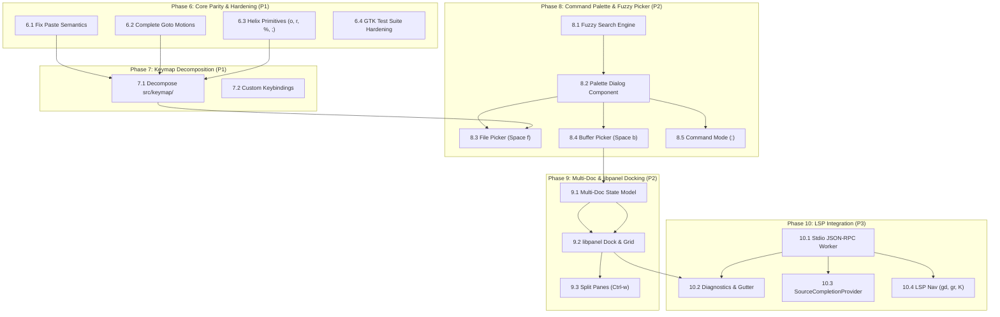

# Strand Architecture & Refactoring TODO

A prioritized, dependency-ordered roadmap to align Strand with the [Helix](reference/helix) codebase architecture while preserving GTK4/SourceView5 performance invariants.

---

## Architecture Blueprint (Helix vs. Strand Target)

```
Strand Target Structure                 Helix Reference Inspiration
───────────────────────────────────     ───────────────────────────
src/core/                               helix-core/
  ├── chars.rs                            ├── chars.rs
  ├── selection.rs                        ├── selection.rs
  ├── movement.rs                         ├── movement.rs
  ├── textobject.rs                       ├── textobject.rs
  ├── surround.rs                         ├── surround.rs
  └── match_brackets.rs                   └── match_brackets.rs

src/editor/                             helix-view/
  ├── state.rs                            ├── editor.rs
  ├── register.rs                         ├── register.rs / clipboard.rs
  └── theme.rs                            └── theme.rs

src/commands/                           helix-term/commands.rs
  ├── mod.rs (Context, dispatch)          ├── commands.rs (Context<'a>)
  ├── motion.rs                           └── commands/
  └── edit.rs

src/keymap/                             helix-term/keymap/ & helix-view/input.rs
  ├── input.rs (KeyEvent, GDK parser)     ├── input.rs
  ├── trie.rs (Generic KeyTrie + counts)  ├── keymap.rs
  └── default.rs (Default keybindings)    └── default.rs

src/components/                         helix-term/ui/ & compositor.rs
  ├── editor/                             ├── ui/editor.rs
  ├── statusline/                         ├── ui/statusline.rs
  ├── which_key/                          └── ui/info.rs (WhichKey)
  ├── command_palette/                    └── ui/picker.rs
  └── workspace/                          └── tree.rs (libpanel Dock/Grid)

src/lsp/                                helix-lsp/
  ├── client.rs                           ├── transport.rs / client.rs
  ├── worker.rs                           └── relm4::Worker background thread pool
  └── completion.rs                       └── GtkSourceCompletionProvider
```

---

## Completed Milestones (Phases 1–5)

| Phase | Description | Key Deliverables | Status |
|---|---|---|---|
| **Phase 1** | Test Stabilization & Hotpath Performance | `buffer_text()` full document heap allocations replaced with `GtkTextIter` streaming; unit test un-ignoring | Completed |
| **Phase 2** | Core Primitives Decomposition | `src/core/` extracted into single-responsibility modules: `chars.rs`, `selection.rs`, `movement.rs`, `textobject.rs`, `surround.rs`, `match_brackets.rs` | Completed |
| **Phase 3** | Keymap Decoupling & Numerical Counts | Removed `CatchAll`; implemented pure trie + `on_next_key`; numerical count accumulation (`5j`, `3w`) | Completed |
| **Phase 4** | State, Registers & Command Dispatch | Introduced `Context<'a>` & `dispatch()`; added `Registers` (`"`, `0`, `_`, `+`, `*`) with GDK clipboard sync | Completed |
| **Phase 5** | UI Alignment: Statusline & Which-Key | Libadwaita statusline with mode pills, cursor coords, pending keys, notifications; floating Which-Key overlay | Completed |

---

## Prioritized Progressive Task Checklist

### Phase 6: Core Editing & Motion Parity with Helix (Refactor & Features)
*Goal: Fix behavioral discrepancies identified during code review and bring single-buffer editing to full Helix baseline.*

- [ ] **6.1 Fix & refine paste semantics (`paste_before` vs `paste_after` & Linewise paste)**
  - **Priority**: P1 (Immediate Refactor)
  - **Files**: `src/core/movement.rs`, `src/commands/edit.rs`, `src/keymap/trie.rs`
  - **Details**:
    - Differentiate `paste_after` (`p`) vs `paste_before` (`P`). When there is no selection, `paste_after` inserts after the cursor character; `paste_before` inserts before the cursor character.
    - Add linewise paste detection: if the text in register ends with `\n`, `paste_after` inserts a new line below the current line; `paste_before` inserts a new line above.
    - Exit `Mode::Select` back to `Mode::Normal` on paste execution (matching Helix).
    - Map `P` (`EditorAction::PasteBefore`) in Normal mode keybindings.
  - **Verification**: Dedicated tests for point-cursor paste, selection-replacement paste, and multiline paste.

- [ ] **6.2 Complete Helix `Goto` motion suite (`g` prefix)**
  - **Priority**: P1 (Feature)
  - **Files**: `src/core/movement.rs`, `src/commands/motion.rs`, `src/keymap/actions.rs`, `src/keymap/trie.rs`
  - **Details**:
    - Replace placeholder `gg` with real `goto_file_start` (jumping to line 0, or line `count - 1` if count is provided, e.g. `42gg`).
    - Implement `ge` (`goto_file_end` / last line of document).
    - Implement `gh` (`goto_line_start`) and `gl` (`goto_line_end`).
    - Implement `gs` (`goto_first_nonwhitespace`).
    - Expose actions in `EditorAction` and wire them into `build_goto_node()`.
  - **Verification**: Unit tests covering `gh`, `gl`, `gs`, `ge`, and `gg` with and without numerical count.

- [ ] **6.3 Essential Helix editing primitives (`o`/`O`, `r`, `%`, `;`, `Alt-;`, `~`)**
  - **Priority**: P1 (Feature)
  - **Files**: `src/core/movement.rs`, `src/commands/edit.rs`, `src/keymap/actions.rs`, `src/keymap/trie.rs`
  - **Details**:
    - `o` / `O`: open newline below / above current line, indent appropriately, and transition to Insert mode.
    - `r<char>`: replace character under cursor with next typed char using `on_next_key`.
    - `%`: select entire buffer (`buffer.select_range(&start, &end)`).
    - `;`: collapse selection to a single cursor point at the head.
    - `Alt-;`: flip selection direction (swap anchor and head).
    - `~`: toggle case of characters in active selection.
  - **Verification**: Unit tests for each editing primitive verifying buffer text, cursor position, and mode transitions.

- [ ] **6.4 GTK Test Suite Serialization & Hardening**
  - **Priority**: P1 (Refactor & Test Reliability)
  - **Files**: `src/components/editor/controller.rs`, `src/core/movement.rs`, `src/components/statusline/mod.rs`
  - **Details**:
    - Resolve the multi-threaded GTK test initialization hazard where `ensure_gtk()` panics in `gtk::TextBuffer::new` on secondary threads and causes silent test skipping.
    - Ensure tests run deterministically using serialized GTK execution or a shared test context without false-positive skips.
  - **Verification**: `cargo test` executes all tests with `--nocapture` without any thread panics.

---

### Phase 7: Keymap & Input Module Decomposition
*Goal: Decompose the 860-line `trie.rs` monolith to cleanly mirror `helix-term/keymap/` and `helix-view/input.rs`.*

- [ ] **7.1 Decompose `src/keymap/` into single-responsibility modules**
  - **Priority**: P1 (Refactor)
  - **Files**: `src/keymap/input.rs`, `src/keymap/trie.rs`, `src/keymap/default.rs`, `src/keymap/mod.rs`
  - **Details**:
    - Extract `KeyEvent`, `KeyCode`, `KeyModifiers`, and `gdk_key_to_event()` into `src/keymap/input.rs`.
    - Retain only generic `KeyTrie`, `KeyTrieNode`, `KeymapResult`, and count prefix logic in `src/keymap/trie.rs`.
    - Move `default_keymap()`, `build_space_node()`, `build_match_node()`, and `build_goto_node()` into `src/keymap/default.rs`.
  - **Verification**: `cargo check`, `cargo test` pass with 0 warnings.

- [ ] **7.2 Keymap Configuration & Custom Bindings Abstraction**
  - **Priority**: P2 (Architecture)
  - **Files**: `src/keymap/mod.rs`, `src/keymap/default.rs`
  - **Details**:
    - Lay groundwork for user key remapping (similar to Helix `config.toml [keys.normal]`).
    - Provide an API to merge custom keybinding overrides into `KeyTrieRoot`.
  - **Verification**: Unit tests demonstrating overriding a default keybinding (e.g. mapping `C-s` to a command).

---

### Phase 8: Command Palette & Fuzzy Picker (`Space f` / `Space b` / `:`)
*Goal: Implement Phase 4 picker capabilities from AGENTS.md using Libadwaita dialogs and fuzzy search.*

- [ ] **8.1 Integrate Fuzzy Matcher Engine**
  - **Priority**: P2 (Feature)
  - **Dependencies**: None
  - **Files**: `Cargo.toml`, `src/core/fuzzy.rs` or `src/components/command_palette/matcher.rs`
  - **Details**:
    - Add `fuzzy-matcher` or `nucleo` dependency.
    - Create a search scoring interface for item filtering and match range highlighting.
  - **Verification**: Unit tests benchmarking sub-millisecond filtering over 10,000 strings.

- [ ] **8.2 Command Palette Dialog Component (`src/components/command_palette/`)**
  - **Priority**: P2 (UI Component)
  - **Dependencies**: 8.1
  - **Files**: `src/components/command_palette/mod.rs`, `src/components/command_palette/view.rs`
  - **Details**:
    - Create modal picker using `adw::Dialog` (or `gtk::Window` overlay), with `GtkSearchEntry` and `GtkListView`.
    - Support keyboard navigation (`Up`/`Down`, `C-n`/`C-p`, `Enter` to select, `Esc` to dismiss).
  - **Verification**: Interactive verification of palette opening, filtering, keyboard navigation, and closing.

- [ ] **8.3 File Picker (`Space f`)**
  - **Priority**: P2 (Feature)
  - **Dependencies**: 8.2
  - **Files**: `src/components/command_palette/files.rs`
  - **Details**:
    - Walk workspace directory, respecting `.gitignore` and hidden files.
    - Wire `<Space>f` in keymap to open file picker; opening a file loads it into `GtkSourceBuffer`.
  - **Verification**: Open existing file in repository via `Space f`.

- [ ] **8.4 Buffer Picker (`Space b`)**
  - **Priority**: P2 (Feature)
  - **Dependencies**: 8.2
  - **Files**: `src/components/command_palette/buffers.rs`
  - **Details**:
    - List open documents with file name, relative path, and modified status indicator.
    - Switch active buffer on selection.
  - **Verification**: Open multiple buffers and toggle between them using `Space b`.

- [ ] **8.5 Command Line Prompt (`:`)**
  - **Priority**: P2 (Feature)
  - **Dependencies**: 8.2
  - **Files**: `src/commands/mod.rs`, `src/components/command_palette/commands.rs`
  - **Details**:
    - Implement Helix-style command mode triggered by `:`.
    - Built-in commands: `:w` (save file), `:q` (quit), `:e <path>` (open file), `:theme <name>` (switch Catppuccin theme flavor).
  - **Verification**: Type `:w` to write document; `:theme catppuccin-latte` to switch theme live.

---

### Phase 9: Multi-Document Workspace & Docking (`libpanel`) (AGENTS.md Phase 4)
*Goal: Replace single-view host with a multi-document layout using `libpanel`.*

- [ ] **9.1 Multi-Document State Architecture (`src/editor/document.rs`, `src/editor/state.rs`)**
  - **Priority**: P2 (Architecture)
  - **Files**: `src/editor/document.rs`, `src/editor/mod.rs`
  - **Details**:
    - Define `Document` holding `sourceview5::Buffer`, file path, modification status, undo tracking, and syntax language.
    - Update `EditorState` to manage multiple documents, tracking active document ID and document collection.
  - **Verification**: Unit tests adding, retrieving, closing, and switching documents.

- [ ] **9.2 Libpanel Dock & Frame Integration (`src/components/workspace/`)**
  - **Priority**: P2 (UI Architecture)
  - **Dependencies**: 9.1
  - **Files**: `Cargo.toml`, `src/components/workspace/mod.rs`, `src/app.rs`
  - **Details**:
    - Add `panel` (v0.7+) dependency to `Cargo.toml`.
    - Replace single `GtkScrolledWindow` in `App` with `panel::Dock` holding `panel::Grid` and `panel::Frame`.
    - Wrap editor views inside `panel::Frame` tabs.
  - **Verification**: Launch app with multiple document tabs in the panel grid.

- [ ] **9.3 Window Split & Navigation Motions (`Space w` / `Ctrl-w`)**
  - **Priority**: P3 (Feature)
  - **Dependencies**: 9.2
  - **Files**: `src/keymap/default.rs`, `src/commands/mod.rs`
  - **Details**:
    - Implement window split actions: vertical split (`Ctrl-w v` / `Space w v`), horizontal split (`Ctrl-w s` / `Space w s`).
    - Implement pane focus switching: `Ctrl-w h/j/k/l`.
  - **Verification**: Split view into two panes side by side and switch focus.

---

### Phase 10: LSP Client & Language Intelligence (AGENTS.md Phase 5)
*Goal: Integrate background language servers over stdio with native SourceView5 completion and diagnostics.*

- [ ] **10.1 Stdio JSON-RPC Worker (`src/lsp/client.rs`, `src/lsp/worker.rs`)**
  - **Priority**: P3 (Architecture)
  - **Dependencies**: None
  - **Files**: `Cargo.toml`, `src/lsp/mod.rs`, `src/lsp/client.rs`, `src/lsp/worker.rs`
  - **Details**:
    - Add `lsp-types` and `async-channel` dependencies.
    - Implement background worker using `relm4::Worker` (thread pool) spawning language servers over stdio (`stdin`/`stdout`).
    - Implement LSP lifecycle: initialize handshake, `textDocument/didOpen`, `textDocument/didChange`, `textDocument/didClose`.
  - **Verification**: Spawn `rust-analyzer` on a project file and complete initialize handshake.

- [ ] **10.2 Gutter Diagnostics & Text Underlines (`src/lsp/diagnostics.rs`)**
  - **Priority**: P3 (Feature)
  - **Dependencies**: 10.1
  - **Files**: `src/lsp/diagnostics.rs`, `src/components/statusline/`
  - **Details**:
    - Handle `textDocument/publishDiagnostics`.
    - Add `GtkTextTag` with wavy underlines (`PANGO_UNDERLINE_ERROR`/`WAVY`) for errors and warnings.
    - Integrate with `GtkSourceGutterRendererPixbuf` and statusline diagnostic counters.
  - **Verification**: Introduce syntax error in Rust buffer; verify gutter icon and wavy underline appear.

- [ ] **10.3 Code Completion (`src/lsp/completion.rs`)**
  - **Priority**: P3 (Feature)
  - **Dependencies**: 10.1
  - **Files**: `src/lsp/completion.rs`
  - **Details**:
    - Implement `GtkSourceCompletionProvider` requesting `textDocument/completion`.
    - Present completions using native `GtkSourceCompletion` popup.
  - **Verification**: Trigger autocompletion on standard library symbols in Rust buffer.

- [ ] **10.4 LSP Code Navigation (`gd`, `gy`, `gr`, `K`)**
  - **Priority**: P3 (Feature)
  - **Dependencies**: 10.1
  - **Files**: `src/commands/mod.rs`, `src/keymap/default.rs`
  - **Details**:
    - Implement `goto_definition` (`gd`), `goto_type_definition` (`gy`), `goto_reference` (`gr`).
    - Implement hover documentation popover (`K` in Normal mode).
  - **Verification**: Execute `gd` on a function call to jump to its definition.

---

## Dependency Graph


